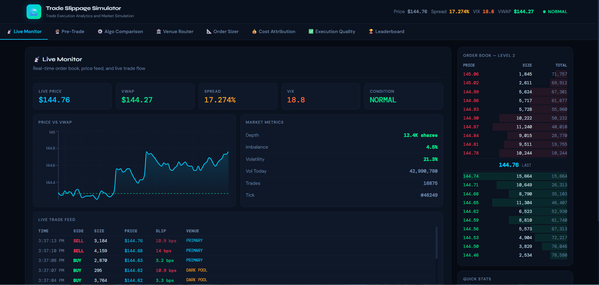

# Trade Slippage Simulator

A full-stack trading execution simulator for slippage analysis, order book visualization, and execution strategy benchmarking.

## Overview

Trade Slippage Simulator is an interactive analytics platform that models how execution quality changes with order size, liquidity, spread, volatility, timing, venue choice, and execution strategy.

It is designed to demonstrate key market microstructure concepts through a live simulated trading environment and analytics dashboards.

## Dashboard Preview



## Features

- Real-time order book simulation
- Pre-trade slippage estimation
- Execution algorithm comparison
- Venue routing analysis
- Order sizing optimization
- Cost attribution dashboard
- Execution quality dashboard
- Leaderboard and gamified tracking

## Core Concepts

This project is based on the execution cost framework:

```text
Slippage = Market Impact + Bid-Ask Cost + Opportunity Cost
```

It also demonstrates common execution strategies:

- VWAP
- TWAP
- POV
- Implementation Shortfall

## Tech Stack

### Frontend

- React
- Vite
- Zustand
- Recharts
- WebSocket client

### Backend

- Python
- FastAPI
- Uvicorn
- Pydantic
- NumPy

### Data and Tooling

- SQLite for local development
- PostgreSQL schema for production-style setup
- Docker Compose
- GitHub Actions CI

## Project Structure

```text
trade-slippage-simulator/
├── .github/workflows/
├── backend/
├── database/
├── docs/
├── frontend/
├── docker-compose.yml
├── start.sh
└── README.md
```

## Run Locally

### 1. Start the backend

```bash
cd backend
python -m pip install -r requirements.txt
python run.py
```

Backend runs at:

```text
http://localhost:8000
```

### 2. Start the frontend

Open a new terminal:

```bash
cd frontend
npm install
npm run dev
```

Frontend usually runs at:

```text
http://localhost:5173
```

If that port is already busy, Vite may use another port such as:

```text
http://localhost:5174
http://localhost:5175
http://localhost:5176
```

Use the local URL shown in the terminal.

### 3. Open the app

After both servers are running:

- open the frontend URL from the terminal
- backend API docs are available at `http://localhost:8000/docs`

## Testing

### Backend tests

```bash
cd backend
python -m unittest discover tests -v
```

### Frontend production build

```bash
cd frontend
npm run build
```

## API Docs

Interactive backend docs:

```text
http://localhost:8000/docs
```

Health check:

```text
http://localhost:8000/health
```

## Example Use Cases

This project can be used to demonstrate:

- slippage analysis
- market microstructure concepts
- execution strategy benchmarking
- full-stack real-time dashboard design
- backend simulation architecture
- financial analytics product development

## Future Improvements

- real PostgreSQL runtime integration
- Redis-backed live state caching
- more realistic market data generation
- authenticated user accounts
- cloud deployment
- additional execution benchmarks

## Author

**Anuj Ojha**  
GitHub: [Anuj7411](https://github.com/Anuj7411)
